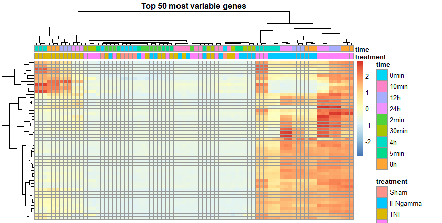

# RNA-seq Differential Expression Analysis of GSE213111

An independent R-based RNA-seq portfolio project investigating the transcriptional response of human endothelial cells to inflammatory cytokine stimulation.

## Project context

This project was developed independently after training in R and bioinformatics at **UBDS School**. It applies methods practiced during the training to a public GEO dataset and documents a complete student-level RNA-seq analysis workflow.

The project is presented as a **student portfolio analysis**, not as a production bioinformatics pipeline. The focus is on reproducible analysis, visualization, and biological interpretation.

## Research question

How does cytokine stimulation affect gene expression in human endothelial cells over time, and which biological processes are associated with the response at 4 hours?

## Dataset

**GSE213111**: *The endothelial inflammatory repertoire: a multi-omic delineation of cytokine induced endothelial inflammatory states*

The dataset contains RNA-seq measurements from blood outgrowth endothelial cells exposed to TNF, IFNγ, TNF + IFNγ and Sham control across multiple time points.

## Analysis workflow

1. Retrieve sample metadata from GEO with `GEOquery`.
2. Download the supplementary RNA-seq count matrix from GEO.
3. Match sample metadata to count-matrix columns using GEO sample IDs.
4. Filter genes with count ≥10 in at least 3 samples.
5. Perform differential expression analysis with `DESeq2` using a treatment-time group factor.
6. Define DEGs using adjusted p-value < 0.05 and |log2 fold change| ≥ 1.
7. Inspect sample structure using PCA and a heatmap of the 50 most variable genes.
8. Annotate Ensembl gene IDs with `org.Hs.eg.db`.
9. Perform GO Biological Process enrichment with `clusterProfiler`.
10. Compare enriched processes across TNF, IFNγ and TNF + IFNγ at 4 hours.

## Results

At 4 hours, cytokine stimulation produced substantial transcriptional changes:

| Comparison | DEGs | Upregulated | Downregulated |
|---|---:|---:|---:|
| TNF vs Sham | 1166 | 727 | 439 |
| IFNγ vs Sham | 1094 | 718 | 376 |
| TNF + IFNγ vs Sham | 2057 | 1209 | 848 |

The TNF 4-hour comparison included inflammatory endothelial genes such as **VCAM1**, **ICAM1**, **CX3CL1**, **LTB**, **TNFAIP3**, **TNFAIP2**, **NFKBIA** and **IRF1**.

GO enrichment highlighted inflammatory, innate immune, cytokine, chemotaxis and interferon-associated transcriptional programs. The combined TNF + IFNγ condition showed a broad response across these processes.

Terms such as `response to virus` and `response to lipopolysaccharide` were interpreted as shared transcriptional programs rather than evidence of direct exposure to viruses or bacterial products.

## Quality assessment

PCA showed separation of samples by treatment and time, while biological replicates generally clustered together. The heatmap of the most variable genes showed patterns broadly consistent with the PCA structure.

## Figures

### Differential expression over time


### PCA


### Heatmap of the 50 most variable genes



### TNF 4h volcano plot


### GO enrichment at 4h


### Shared GO enrichment at 4h


## Repository structure

```text
rna-seq-differential-expression/
├── README.md
├── .gitignore
├── scripts/
│   └── analysis.R
├── figures/
│   ├── DEG_over_time.png
│   ├── PCA.png
│   ├── heat.png
│   ├── volcano_TNF_4h.png
│   ├── GO_TNF_4h.png
│   ├── GO_IFNgamma_4h.png
│   ├── GO_TNF_IFNgamma_4h.png
│   └── GO_shared_4h.png
└── results/
    └── tables/
        └── README.md
```

## Main R / Bioconductor packages

- `GEOquery`
- `DESeq2`
- `ggplot2`
- `pheatmap`
- `AnnotationDbi`
- `org.Hs.eg.db`
- `clusterProfiler`
- `enrichplot`

## Reproducibility

The analysis script downloads the GEO metadata and supplementary count matrix when executed. It saves the main differential-expression and GO-enrichment tables, figures, and session information to the documented output locations.

Downloaded input files and generated result tables are excluded from version control by `.gitignore`. The committed figures provide a visual record of the analysis results.

To reproduce the analysis, install the packages listed above and run:

```r
source("scripts/analysis.R")
```

## Scope and limitations

This is a student-level portfolio project based on a public dataset. The analysis focuses on differential expression, exploratory sample-level visualization, and GO enrichment. It uses a combined treatment-time factor rather than a more advanced multifactorial or interaction model. The results are therefore presented as an exploratory analysis of transcriptional responses rather than as a production-grade statistical pipeline.
