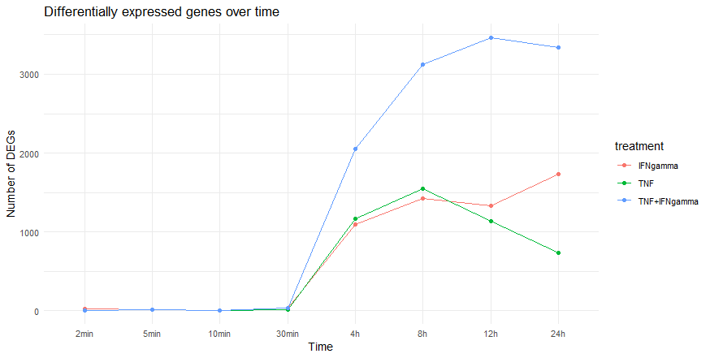
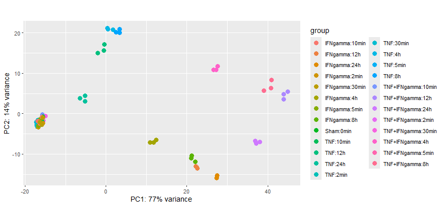
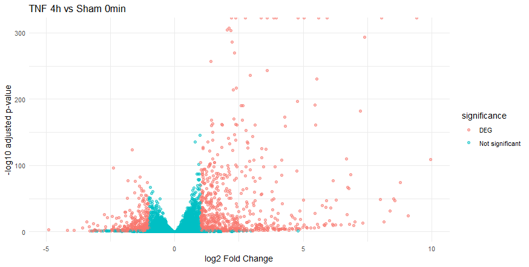
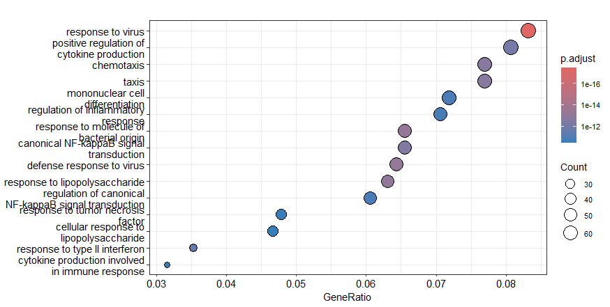
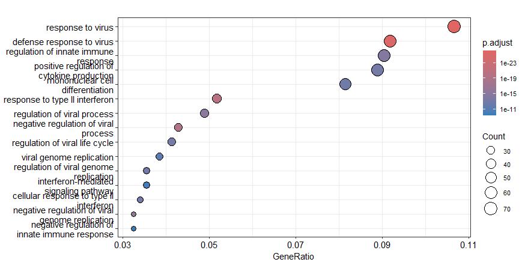
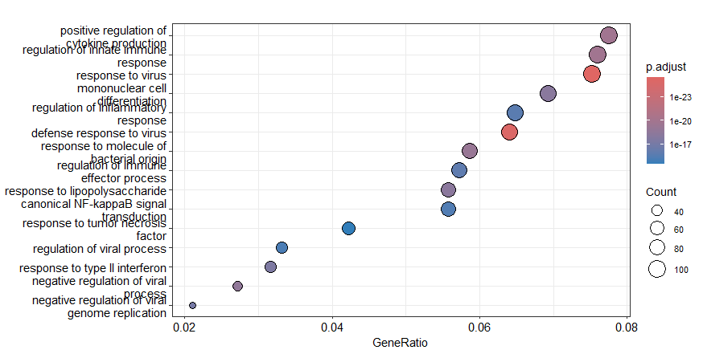
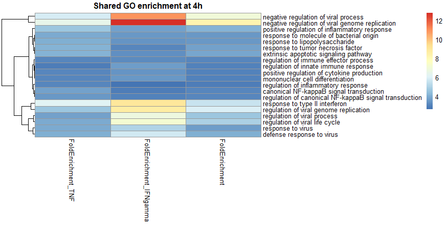

# RNA-seq Differential Expression Analysis of GSE213111
## Training background

This project was developed based on the skills and methods learned during the **UBDS School** training in R and bioinformatics.

The project demonstrates practical application of:
- R programming for biological data analysis
- RNA-seq data preprocessing
- differential expression analysis with DESeq2
- data visualization with ggplot2 and pheatmap
- gene annotation with AnnotationDbi and org.Hs.eg.db
- GO enrichment analysis with clusterProfiler


This repository contains an RNA-seq analysis of the human endothelial inflammatory response using GEO dataset **GSE213111**.

## Dataset

**GSE213111**: *The endothelial inflammatory repertoire: a multi-omic delineation of cytokine induced endothelial inflammatory states*

The dataset contains RNA-seq measurements from blood outgrowth endothelial cells exposed to TNF, IFNγ, TNF + IFNγ and Sham control across multiple time points.

## Aim

The aim was to identify differentially expressed genes following cytokine stimulation and characterize the biological processes associated with the transcriptional response, with particular focus on the 4-hour time point.

## Analysis workflow

1. GEO metadata were retrieved with `GEOquery`.
2. The supplementary RNA-seq count matrix was downloaded from GEO.
3. Sample metadata were matched to the count matrix using GEO sample IDs.
4. Genes with count ≥10 in at least 3 samples were retained.
5. Differential expression analysis was performed with `DESeq2` using treatment-time group as the experimental factor.
6. DEGs were defined as adjusted p-value < 0.05 and |log2 fold change| ≥ 1.
7. PCA and a heatmap of the 50 most variable genes were used for quality assessment.
8. Genes were annotated using `org.Hs.eg.db`.
9. GO Biological Process enrichment was performed with `clusterProfiler`.
10. Shared GO processes between TNF, IFNγ and TNF + IFNγ at 4 hours were compared.

## Results

At 4 hours:

| Comparison | DEGs | Upregulated | Downregulated |
|---|---:|---:|---:|
| TNF vs Sham | 1166 | 727 | 439 |
| IFNγ vs Sham | 1094 | 718 | 376 |
| TNF + IFNγ vs Sham | 2057 | 1209 | 848 |

The TNF 4-hour comparison showed strong induction of inflammatory endothelial genes including **VCAM1**, **ICAM1**, **CX3CL1**, **LTB**, **TNFAIP3**, **TNFAIP2**, **NFKBIA** and **IRF1**.

GO enrichment highlighted antiviral/innate immune responses, cytokine production, chemotaxis and canonical NF-κB signaling. IFNγ showed particularly strong interferon-associated and antiviral programs, while the combined TNF + IFNγ condition showed a broad inflammatory and innate immune response.

Terms such as `response to virus` and `response to lipopolysaccharide` represent shared transcriptional programs and do not indicate direct exposure to viruses or bacterial products.

## Quality control

PCA showed separation of samples according to treatment and time, with replicates generally clustering closely. The heatmap of the 50 most variable genes showed patterns consistent with the PCA.

## Figures

### Differential expression over time



### PCA



### Heatmap of the 50 most variable genes


### TNF 4h volcano plot



### GO enrichment at 4h







### Shared GO enrichment at 4h



## Repository structure

```text
rna-seq-differential-expression/
├── README.md
├── scripts/
│   └── analysis.R
└── figures/
    ├── DEG_over_time.png
    ├── PCA.png
    ├── heatmap_top50.png
    ├── volcano_TNF_4h.png
    ├── GO_TNF_4h.png
    ├── GO_IFNgamma_4h.png
    ├── GO_TNF_IFNgamma_4h.png
    └── GO_shared_4h.png
```

## Main R packages

- GEOquery
- DESeq2
- ggplot2
- pheatmap
- AnnotationDbi
- org.Hs.eg.db
- clusterProfiler
- enrichplot

## Reproducibility

The analysis script contains the workflow from downloading GEO metadata and count data through differential expression and GO enrichment. Input count data are downloaded directly from GEO when the script is executed.
